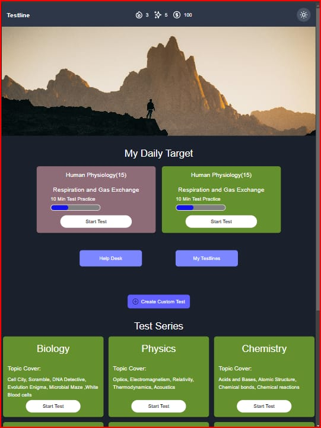
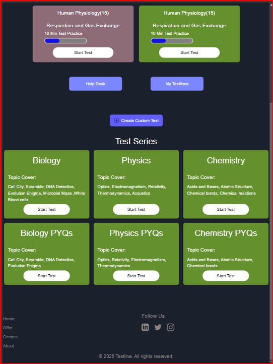
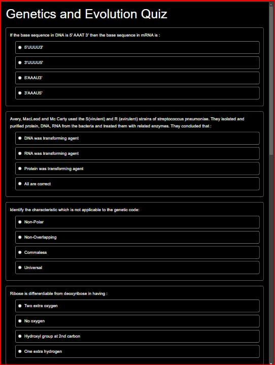
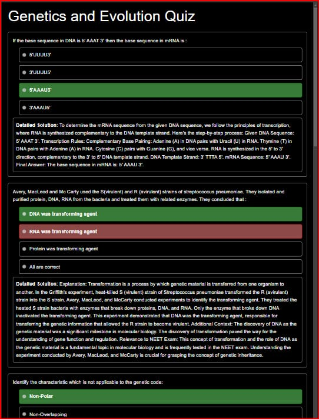
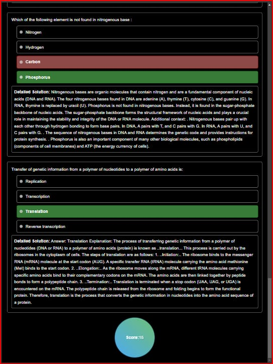
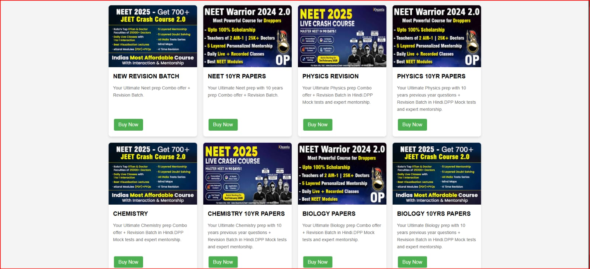

# Testline Project

## Overview

Testline is a demonstration project designed to explore modern web development techniques and integration. This repository includes a mix of HTML, CSS, JavaScript, and Python code along with Tailwind CSS for styling. It serves as a testing ground for creating responsive layouts, dynamic content rendering, and integrating various frontend and backend technologies.

## Features

- **Responsive Design:** Utilizes Tailwind CSS to build responsive and modern interfaces.
- **Multiple Demo Pages:** Includes several HTML pages (e.g., Doc1.html, Doc2.html, Doc3.html, Doc4.html, Pay.html, Quiz.html) to showcase different design elements and functionalities.
- **Dynamic Interactions:** JavaScript and JSON data (data.json) are used to add dynamic and interactive elements to the web pages.
- **Backend Integration:** Contains a Python script (ABC.py) to demonstrate backend or scripting capabilities.
- **Extensible Structure:** A clear folder structure and configuration (tailwind.config.js, package.json) support further development and feature additions.

## Project Structure

```
testline/
├── .vscode/                 # VS Code configuration settings
├── Tailwind/                # Tailwind CSS assets and configuration
├── node_modules/            # Node.js dependencies (auto-generated)
├── src/                     # Source files and assets
├── A.avif                   # Sample image asset
├── AA.jfif                  # Sample image asset
├── AK.jfif                  # Sample image asset
├── AP.jfif                  # Sample image asset
├── AS.png                   # Sample image asset
├── AZA.png                  # Sample image asset
├── AZZ.png                  # Sample image asset
├── IMAGE.jfif               # Additional image asset (if needed)
├── NEEEt.jfif               # Additional image asset (if needed)
├── NEET.jfif                # Additional image asset (if needed)
├── NET.jfif                 # Additional image asset (if needed)
├── QW.jfif                  # Additional image asset (if needed)
├── Doc1.html                # Demo HTML page 1
├── Doc2.html                # Demo HTML page 2
├── Doc3.html                # Demo HTML page 3
├── Doc4.html                # Demo HTML page 4
├── Pay.html                 # Payment demo page
├── Quiz.html                # Quiz demo page
├── ABC.py                   # Python script for backend testing
├── data.json                # JSON data file for dynamic content
├── package.json             # Node package configuration
├── package-lock.json        # Lock file for Node dependencies
├── script.js                # JavaScript file for dynamic functionality
├── style.css                # Main stylesheet
└── tailwind.config.js       # Tailwind CSS configuration
```

## Installation

1. **Clone the Repository:**
   ```bash
   git clone https://github.com/1-DARK/testline.git
   cd testline
   ```
2. **Install Dependencies:**
   ```bash
   npm install
   ```
3. **Run the Project:**
   ```bash
   npm start
   ```
   Alternatively, you can open the HTML files directly in your browser for a quick demo.

## Usage

- **HTML Pages:** Open any of the demo HTML pages (e.g., `Doc1.html`, `Quiz.html`) in your preferred browser to see the interface and interactive elements.
- **Python Script:** Execute `python ABC.py` to run the Python code and test backend functionalities.
- **Tailwind CSS:** Customize your styles by modifying `tailwind.config.js` and `style.css`.
- **Dynamic Data:** Modify `data.json` and observe how changes are reflected via JavaScript in the project.

## Screenshots

Below are placeholders for 7 images that capture various aspects of the project. Replace the `path/to/imageX.png` with your actual image file paths.

1. **Screenshot 1:**
   
2. **Screenshot 2:**
   
3. **Screenshot 3:**
   
4. **Screenshot 4:**
   
5. **Screenshot 5:**
   
6. **Screenshot 6:**
   
7. **Screenshot 7:**
   

## Demo Video

[](static/video/video)

## Contributing

Contributions are welcome! To contribute:

1. Fork the repository.
2. Create a new branch (`git checkout -b feature/your-feature`).
3. Commit your changes (`git commit -m 'Add your feature'`).
4. Push to the branch (`git push origin feature/your-feature`).
5. Open a pull request with a detailed description of your changes.

## License

This project is licensed under the MIT License. See the [LICENSE](LICENSE) file for further details.

## Acknowledgements

- Thank you to all the contributors and the open source community.
- Special thanks to the developers behind Tailwind CSS and Node.js for their amazing tools and frameworks.

---
